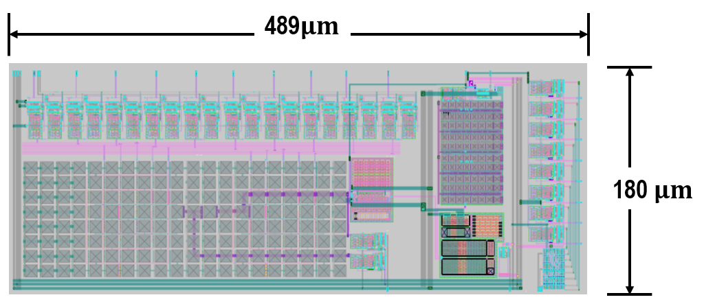

# Overview
This repo contains a 10-Bit, 8-channel SAR Analog-Digital-Converter without SAR controller titled "EF_ADCS1008NC"

# Prerequisites

*	OS tested: [Linux Ubuntu 64-bit 22.04.1-desktop-amd64](https://ubuntu.com/download/desktop)
*	[XSCHEM V3.1.0](https://xschem.sourceforge.io/stefan/index.html) is a schematic capture program that provides a graphical method of the electronic schematic circuit, easily.
*	[NGSPICE-36](http://ngspice.sourceforge.net/download.html) is an open-source spice simulator. It is exploited to simulate and verify the designed circuit.
*	[MAGIC 8.3.427](http://opencircuitdesign.com/magic/) is for layout implementation and DRC checks as well.
*	[NETGEN 1.5.245](http://opencircuitdesign.com/netgen/) is used for comparing netlists of the layout and schematic, known as layout vs. schematic (LVS).
*	[PYTHON 3.10.12](https://www.python.org/) can be integrated with the NGSPICE simulator for data manipulation/analysis of the simulation result.

# Quickstart

1. Clone repo or download via IPM

      * To clone repo

      ```
      git clone https://github.com/efabless/EF_ADCS1008NC.git
      ```

      * To download via [IPM](https://github.com/efabless/IPM/blob/main/README.md)

      ```
      ipm install EF_ADCS1008NC
      ```

2. Set environment variables

      You need to already have the PDK, you can use [volare](https://github.com/efabless/volare) to download the pdk
      ```
      export PDK_ROOT=<path to pdk>
      ```

3. Run simulation

      To run simulation go to `./verify/spice`, and run these commands
      ```
      make verify-<test_bench>-<SIM>
      ```
      The `test_bench` is the name of the test bench for example `EF_ADCS1008NC_tb_w_sar_ctrl.spice`, the `SIM` is either `layout` or `schematic`
      
      For example:
      ```
      make verify-EF_ADCS1008NC_tb_w_sar_ctrl.spice-layout
      ```

      You can find all test benches that can be ran using this command
      ```
      make list
      ```

      **NOTE: ngspice DOES NOT handle environment variables used in the test benches. the Makefile handles that for you, if you wish to use your own command make sure you manually update the spice files**

# 10-Bit, Eight-Channel SAR ADC Without Controller
## 1. Description
The EF_ADCS1008NC is a low-power,eight-channel CMOS 10-bit analog-to-digital converter with a flexible parallel interface. It has an off-chip SAR controller. The converter is based on a successive approximation register (SAR) architecture with an internal track-and-hold circuit. It can be configured to accept a 2.5 V single-ended input span. The output parallel data is binary and compatible with many common DSP parallel interfaces. The EF_ADCS1008NC operates with a dual power supply; 1.8 V and 3.3 V supply the digital and analog IP blocks, respectively. The functional block diagram is presented in Figure 1.
## 2. Features
*Input Sinusoidal of XX kHz, Clock Frequency of XMHz, Sampling frequency of XX KHz* 

*  10-bit Parallel Interface
*  Without SAR Controller
*  8-channel Analog Input
*  Dual Power Supply With 1.8 V, 3.3 V
* Track and Hold
* 2.5 V Eight-Ended Input Span

## 3. Applications

* Wearable Systems
* Data Acquisition Systems
* Instrumentation and Control Systems
* DSP front ends Systems

  

*Figure 1. Functional Block Diagram of ADC*

## 4. Pin Configuration and Functions

* Corresponding to the Block Diagram of the EF_ADCS1008NC, each pin name with its function is described in Table 1. 

*Table 1. Pin Configuration*


*Figure 2.Typical Connection*

*Noted: 
•	Typically, EN is connected to the digital input of 1.8 V, VH represents the reference voltage of ADC, and VL is connected to 0V. VDD and DVDD are connected to 3.3V and 1.8V. VSS and DVSS are connected to 0 V. CLK, RST_N, SOC are set as described in the blow timing diagram.
•	A 10-bit SAR controller is required. Its input signals are; CLK is the input clock signal, RST_N indicates the rest input signal, SOC stands for the input start-of-conversion, and CMP represents the input signal from the comparator's output.  The output terminals of the controller are; EOC is the end-of-conversion, HOLD is an output signal to retain the sampled input voltage (VIN), RST is to reset the DAC, DATA [9]-DATA [0] are the output digital code. It is recommended that the SAR controller satisfy the next required; the SAR controller has a TCLK, a clock period time, and a sampling time of no less than 13*TCLK. RST_N begins at a low value and increases to a high value at 4.25*TCLK, SOC begins at a low level and after 6.25* TCLK generates a pulse with an amplitude of TCLK. HOLD becomes high after the end of the SOC's pulse and maintains high within no less than ten of the TCLK. HOLD transits to a low level within 3* TCLK, as a sampling time. EOC is a generated pulse signal after finishing the HOLD’s pulse. RST is executed when the power is ON and after the EOC. DATA[9]-DATA[0] maintains zero however, the binary search or the first iteration begins when the HOLD signal is set to high. The timing diagram is provided as well to illustrate the description and the requirements.*

## 5. Timing Characteristics

*Table 2. Timing Paramters*


(a)


(b)

*Figure 3. (a) ADC Timing Diagram, (b) Analog MUX Timing Diagram.*
*A is an internal point that indicates the selected input signal to the Track/hold block as depicted in Fig. 2.*


## 6. SAR-ADC Layout



*Figure 4. EF_ADCS1008NC’s Layout*

