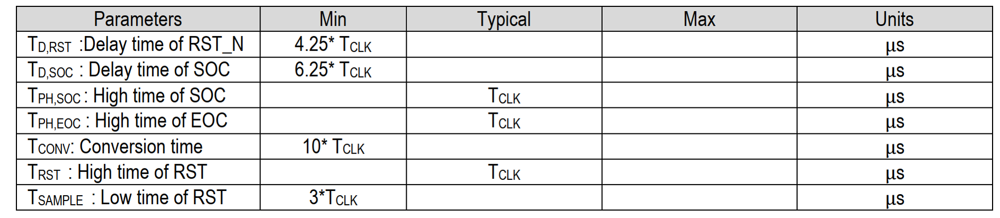
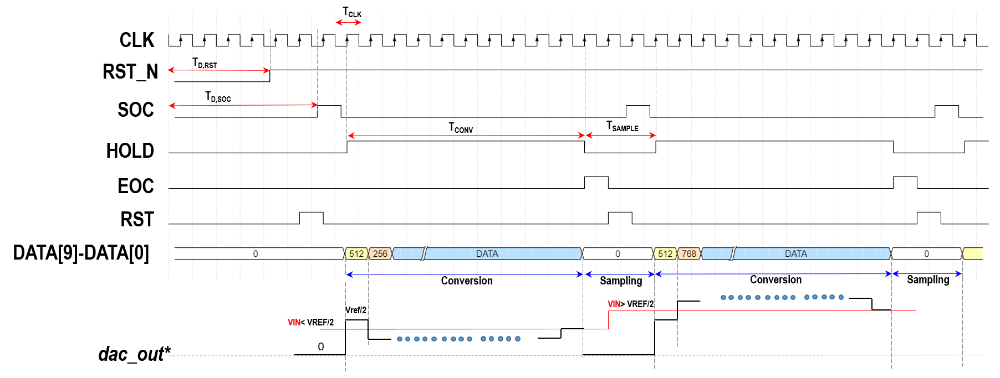

# 10-Bit, XXKSPS, SAR ADC Without Controller
## 1. Description
The EF_ADCS1001NC is a low-power, single-channel CMOS 10-bit analog-to-digital converter with a flexible parallel interface. It has an off-chip SAR controller. The converter is based on a successive approximation register (SAR) architecture with an internal track-and-hold circuit. It can be configured to accept a 2.5 V single-ended input span. The output parallel data is binary and compatible with many common DSP parallel interfaces. The EF_ADCS1001NC operates with a dual power supply; 1.8 V and 3.3 V supply the digital and analog IP blocks, respectively. Normal power consumption reaches XX mW in idle mode. The functional block diagram is presented in Figure 1.
## 2. Features
*Input Sinusoidal of XX kHz, Clock Frequency of XMHz, Sampling frequency of XX KHz* 

*  10-bit Parallel Interface
*  Without SAR Controller
*  8-channel Analog Input
*  Dual Power Supply With 1.8 V, 3.3 V
* Track and Hold
* 2.5 V Eight-Ended Input Span
* SNR: XX dB 
* THDb: XX dB 
* SINAD: XX dB 
* SFDR: XX dB 
* ENOB: XX Bits
* Idle-Power Consumption (CLK is off):
    - 3.3-V Supply: XX mW (Typical)
    - 1.8-V Supply:XX nW (Typical)
## 3. Applications

* Wearable Systems
* Data Acquisition Systems
* Instrumentation and Control Systems
* DSP front ends Systems

  

*Figure 1. Functional Block Diagram of ADC*

## 4. Pin Configuration and Functions

* Corresponding to the Block Diagram of the EF_ADCS1001NC, each pin name with its function is described in Table 1. 

*Table 1. Pin Configuration*

## 5. Timing Characteristics

*Table 2. Timing Paramters*

*Figure 3. ADC Timing Diagram*

## 6. Electrical Characteristics 

* The pre-layout simulation results of the proposed EF_ADCS1001NC are listed in Table 3. 

*Table 3. Electrical Characteristics*

## 7. Typical Performance Curves

* The proposed EF_ADCS1001NC has been designed and simulated using open-source tools with SkyWater technology. Herein, [XSCHEM](https://xschem.sourceforge.io/stefan/index.html) is a schematic capture program that provides a graphical method of the electronic schematic circuit, easily. [NGSPICE](http://ngspice.sourceforge.net/download.html) is an open-source spice simulator. It is exploited to simulate and verify the designed circuit. The layout of the EF_ADCS1001NC is implemented using [MAGIC 8.3](http://opencircuitdesign.com/magic/) and for design rule check (DRC) as well. However, [NETGEN](http://opencircuitdesign.com/netgen/) is used for comparing netlists of the layout and schematic, known as layout vs schematic (LVS). [PYTHON](https://www.python.org/) can be integrated with the NGSPICE simulator for data manipulation/analysis of the simulation result.
